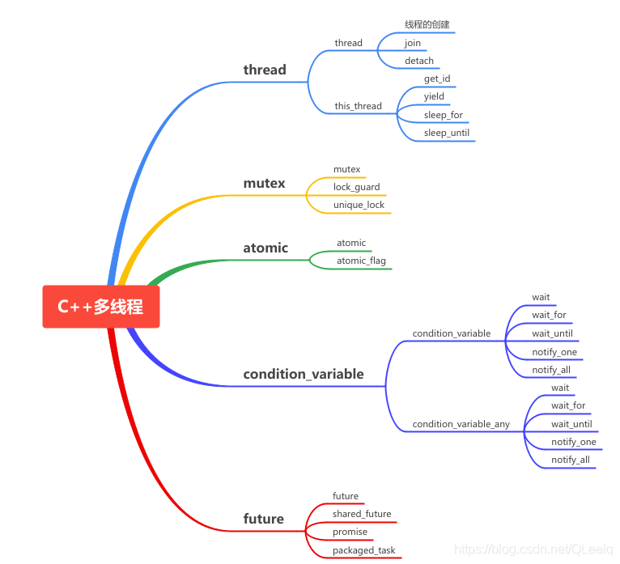
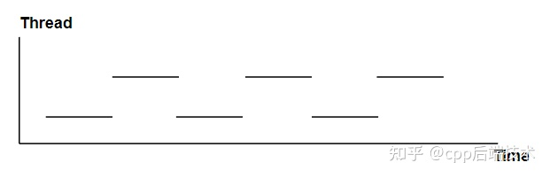
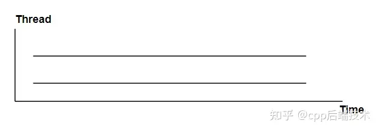
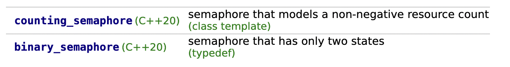

## 1、多线程

传统的C++（C++11标准之前）中并没有引入线程这个概念，在C++11出来之前，如果我们想要在C++中实现多线程，需要借助操作系统平台提供的API，比如Linux的<pthread.h>，或者windows下的<windows.h> 。

C++11提供了语言层面上的多线程，包含在头文件<thread>中。它解决了跨平台的问题，提供了管理线程、保护共享数据、线程间同步操作、原子操作等类。C++11 新标准中引入了5个头文件来支持多线程编程，如下图所示：



### 1.1、多进程与多线程

- 多进程并发

使用多进程并发是将一个应用程序划分为多个独立的进程（每个进程只有一个线程），这些独立的进程间可以互相通信，共同完成任务。由于操作系统对进程提供了大量的保护机制，以避免一个进程修改了另一个进程的数据，使用多进程比使用多线程更容易写出相对安全的代码。但是这也造就了多进程并发的两个缺点：

1. 在进程间的通信，无论是使用信号、套接字，还是文件、管道等方式，其使用要么比较复杂，要么就是速度较慢或者两者兼而有之。
2. 运行多个进程的开销很大，操作系统要分配很多的资源来对这些进程进行管理。

当多个进程并发完成同一个任务时，不可避免的是：**操作同一个数据和进程间的相互通信**，上述的两个缺点也就决定了多进程的并发并不是一个好的选择。所以就引入了多线程的并发。

- 多线程并发

多线程并发指的是在同一个进程中执行多个线程。

优点：有操作系统相关知识的应该知道，线程是轻量级的进程，每个线程可以独立的运行不同的指令序列，但是线程不独立的拥有资源，依赖于创建它的进程而存在。也就是说，同一进程中的多个线程共享相同的地址空间，可以访问进程中的大部分数据，指针和引用可以在线程间进行传递。这样，同一进程内的多个线程能够很方便的进行数据共享以及通信，也就比进程更适用于并发操作。

缺点：由于缺少操作系统提供的保护机制，在多线程共享数据及通信时，就需要程序员做更多的工作以保证对共享数据段的操作是以预想的操作顺序进行的，并且要极力的避免死锁(deadlock)。

### 1.2、多线程理解

- 单CPU内核的多个线程。

一个时间片运行一个线程的代码，并不是真正意义的并行计算。



- 多个cpu或者多个内核

可以做到真正的并行计算。



### 1.3、创建线程

创建线程很简单，只需要把函数添加到线程当中即可。

- 形式1：无参

```c++
#include <iostream>
#include <thread>
void thread_fun() {
    std::cout<<"thread_fun"<<std::endl;
}
int main() {
    std::thread myThread(thread_fun);
    myThread.join();
    return 0;
}
```

- 形式2：有参数

```c++
void thread_fun(int x) {
    std::cout<<x<<std::endl;
}
int main() {
    //在新的线程上面执行thread_run,传入参数10
    std::thread myThread(thread_fun, 10);
    myThread.join();
    return 0;
}
//依次类推，thread_fun可以有多个参数
```

- 形式3: 匿名

```text
std::thread{thread_fun}.join();
//or
std::thread(thread_fun).join();
```

#### 注意点

1. 在Linux/GCC/libstdc++下，C++11 thread库**强制动态连接pthread**，如果你编译连接的时候忘了-pthread参数，执行会报错。

使用g++编译下列的方式：

> g++ test.cpp-o test -l pthread

如果用CMake,链接pthread方法有多种：

```cmake
add_executable(test_thread_hello test.cpp)
# 方法1
target_link_libraries(test_thread_hello pthread)
# 方法2
set(THREADS_PREFER_PTHREAD_FLAG ON)
find_package(Threads REQUIRED)
target_link_libraries(test_thread_hello PUBLIC Threads::Threads)
# 方法3
set_target_properties(test_thread_hello PROPERTIES
        COMPILE_FLAGS "-pthread"
        LINK_FLAGS "-pthread")
```

2. 头文件`#include <thread>`
3. 线程是在创建对象std::thread myThread(thread_fun);时立即执行的，但是一定要记得在当前线程推出前调用join或detach。

### 1.4、join与detach方式

在一个线程A里启动了子线程B后，一定要在线程A销毁前，确定以何种方式等待子线程B执行结束。比如上例中的join。

- detach方式，让子线程与主线程分离，主线程不再干预子线程的运行，主线程无法获取子线程的执行结果，因为主线程此时已经退出。

  代码正常运行，但是main函数退出后，子线程里的printf不会打印出来。

- join方式，阻塞，等待子线程运行结束，才从join()处继续往下执行。

另外，线程是在线程对象创建时立即开始执行，和detach、join方法无关，但是如果不指定join或detach方式，哪怕主线程时间够长、哪怕主线程退出时，子线程早已结束，主线程退出时也会报一个异常。

可以使用joinable判断是join模式还是detach模式。

```text
if (myThread.joinable()) foo.join();
```

（1）join举例

下面的代码，join后面的代码不会被执行，除非子线程结束。

```c++
#include <iostream>
#include <thread>
using namespace std;
void thread_1()
{
  while(1)
  {
  //cout<<"子线程1111"<<endl;
  }
}
void thread_2(int x)
{
  while(1)
  {
  //cout<<"子线程2222"<<endl;
  }
}
int main()
{
    thread first ( thread_1); // 开启线程，调用：thread_1()
    thread second (thread_2,100); // 开启线程，调用：thread_2(100)

    first.join(); // pauses until first finishes 这个操作完了之后才能destroyed
    second.join(); // pauses until second finishes//join完了之后，才能往下执行。
    while(1)
    {
      std::cout << "主线程\n";
    }
    return 0;
}
```

### （2）detach举例

下列代码中，主线程不会等待子线程结束。如果主线程运行结束，程序则结束。

```C++
#include <iostream>
#include <thread>
using namespace std;

void thread_1()
{
  while(1)
  {
      cout<<"子线程1111"<<endl;
  }
}

void thread_2(int x)
{
    while(1)
    {
        cout<<"子线程2222"<<endl;
    }
}

int main()
{
    thread first ( thread_1);  // 开启线程，调用：thread_1()
    thread second (thread_2,100); // 开启线程，调用：thread_2(100)

    first.detach();                
    second.detach();            
    for(int i = 0; i < 10; i++)
    {
        std::cout << "主线程\n";
    }
    return 0;
}
```

### 1.5、this_thread

this_thread是一个类，它有4个功能函数，具体如下：

| 函数        | 使用                                                  | 说明                       |
| ----------- | ----------------------------------------------------- | -------------------------- |
| get_id      | std::this_thread::get_id()                            | 获取线程id                 |
| yield       | std::this_thread::yield()                             | 放弃线程执行，回到就绪状态 |
| sleep_for   | std::this_thread::sleep_for(std::chrono::seconds(1)); | 暂停1秒                    |
| sleep_until | 如下                                                  | sleep到指定时间            |

```C++
using std::chrono::system_clock;
std::time_t tt = system_clock::to_time_t(system_clock::now());
struct std::tm * ptm = std::localtime(&tt);
cout << "Waiting for the next minute to begin...\n";
++ptm->tm_min; //加一分钟
ptm->tm_sec = 0; //秒数设置为0//暂停执行，到下一整分执行
this_thread::sleep_until(system_clock::from_time_t(mktime(ptm)));
```

## 2、mutex

mutex头文件主要声明了与互斥量(mutex)相关的类。mutex提供了4种互斥类型，如下表所示。

| 类型                       | 说明                |
| -------------------------- | ------------------- |
| std::mutex                 | 最基本的 Mutex 类。 |
| std::recursive_mutex       | 递归 Mutex 类。     |
| std::time_mutex            | 定时 Mutex 类。     |
| std::recursive_timed_mutex | 定时递归 Mutex 类。 |

std::mutex 是C++11 中最基本的互斥量，std::mutex 对象提供了独占所有权的特性——即不支持递归地对 std::mutex 对象上锁，而 std::recursive_lock 则可以递归地对互斥量对象上锁。

### 2.1、lock与unlock

mutex常用操作：

- lock()：资源上锁
- unlock()：解锁资源
- trylock()：查看是否上锁，它有下列3种类情况：

（1）未上锁返回false，并锁住；

（2）其他线程已经上锁，返回true；

（3）同一个线程已经对它上锁，将会产生死锁。

死锁：是指两个或两个以上的进程在执行过程中，由于竞争资源或者由于彼此通信而造成的一种阻塞的现象，若无外力作用，它们都将无法推进下去。此时称系统处于死锁状态或系统产生了死锁，这些永远在互相等待的进程称为死锁进程。

下面结合实例对lock和unlock进行说明。

同一个mutex变量上锁之后，一个时间段内，只允许一个线程访问它。例如：

```c++
#include <iostream>
#include <thread>  // std::thread
#include <mutex>  // std::mutex

std::mutex mtx;  // mutex for critical section
void print_block(int n, char c) {
// critical section (exclusive access to std::cout signaled by locking mtx):
    mtx.lock();
    for (int i = 0; i < n; ++i) {
        std::cout << c;
    }
    std::cout << '\n';
    mtx.unlock();
}

void print_block2(int n, char c) {
    std::cout << "before lock" << std::endl;
    mtx.lock();
    std::cout << "middle lock" << std::endl;
    mtx.lock();  // 会在这里停住，这说明std::mutex是不可重入锁
    std::cout << "after lock" << std::endl;
    for (int i = 0; i < n; ++i) {
        std::cout << c;
    }
    std::cout << '\n';
    mtx.unlock();
    mtx.unlock();
}

int main() {
    std::thread th1(print_block, 50, '*');//线程1：打印*
    std::thread th2(print_block, 50, '$');//线程2：打印$

    th1.join();
    th2.join();

    std::thread th3(print_block2, 50, '%');
    th3.join();
    return 0;
}
```

输出：

```text
**************************************************
$$$$$$$$$$$$$$$$$$$$$$$$$$$$$$$$$$$$$$$$$$$$$$$$$$
before lock
middle lock
(卡在这里)
```

std::mutex是不可重入的！当然没人会故意lock两次，但是有时会无意多次lock：

```c++
void print(char c) {
    mtx.lock();
    std::cout<<c<<std::endl;
    mtx.unlock();
}
void print_block3(int n, char c) {
    std::cout << "before lock" << std::endl;
    mtx.lock();
    for (int i = 0; i < n; ++i) {
        std::cout << "middle lock" << std::endl;
        print(c);  // 一般人不会注意print里面会mtx.lock，所以就卡住了。如果函数间调用更复杂，很难用眼睛看出来。
        std::cout << "after lock" << std::endl;
    }
    std::cout << '\n';
    mtx.unlock();
}
```

**可重入锁**也称为递归锁, 就是一个线程不用释放,可以重复的获取一个锁n次,只是在释放的时候,也需要相应的释放n次。

### 2.2、lock_guard

创建lock_guard对象时，它将尝试获取提供给它的互斥锁的所有权。当控制流离开lock_guard对象的作用域时，lock_guard析构并释放互斥量。lock_guard的特点：

- 创建即加锁，作用域结束自动析构并解锁，无需手工解锁
- 不能中途解锁，必须等作用域结束才解锁
- 不能复制

代码举例

```C++
#include <thread>
#include <mutex>
#include <iostream>
int g_i = 0;
std::mutex g_i_mutex;  // protects g_i，用来保护g_i

void safe_increment()
{
    const std::lock_guard<std::mutex> lock(g_i_mutex);
    ++g_i;
    std::cout << std::this_thread::get_id() << ": " << g_i << '\n';// g_i_mutex自动解锁}int main(){
    std::cout << "main id: " <<std::this_thread::get_id()<<std::endl;
    std::cout << "main: " << g_i << '\n';

    std::thread t1(safe_increment);
    std::thread t2(safe_increment);

    t1.join();
    t2.join();

    std::cout << "main: " << g_i << '\n';
}
```

说明：

1. 该程序的功能为，每经过一个线程，g_i 加1。
2. 因为涉及到共同资源g_i ，所以需要一个共同mutex：g_i_mutex。
3. main线程的id为1，所以下次的线程id依次加1。

### 2.3、unique_lock

简单地讲，unique_lock 是 lock_guard 的升级加强版，它具有 lock_guard 的所有功能，同时又具有其他很多方法，使用起来更加灵活方便，能够应对更复杂的锁定需要。unique_lock的特点：

- 创建时可以不锁定（通过指定第二个参数为std::defer_lock），而在需要时再锁定
- 可以随时加锁解锁
- 作用域规则同 lock_grard，析构时自动释放锁
- 不可复制，可移动
- 条件变量需要该类型的锁作为参数（此时必须使用unique_lock）

所有 lock_guard 能够做到的事情，都可以使用 unique_lock 做到，反之则不然。那么何时使lock_guard呢？很简单，需要使用锁的时候，首先考虑使用 lock_guard，因为lock_guard是最简单的锁。

下面是代码举例：

```C++
#include <mutex>
#include <thread>
#include <iostream>
struct Box {
    explicit Box(int num) : num_things{num} {}
    int num_things;
    std::mutex m;
};
void transfer(Box &from, Box &to, int num)
{
    // defer_lock表示暂时unlock，默认自动加锁
    std::unique_lock<std::mutex> lock1(from.m, std::defer_lock);
    std::unique_lock<std::mutex> lock2(to.m, std::defer_lock);//两个同时加锁
    std::lock(lock1, lock2);//或者使用lock1.lock()

    from.num_things -= num;
    to.num_things += num;//作用域结束自动解锁,也可以使用lock1.unlock()手动解锁
}
int main()
{
    Box acc1(100);
    Box acc2(50);

    std::thread t1(transfer, std::ref(acc1), std::ref(acc2), 10);
    std::thread t2(transfer, std::ref(acc2), std::ref(acc1), 5);

    t1.join();
    t2.join();
    std::cout << "acc1 num_things: " << acc1.num_things << std::endl;
    std::cout << "acc2 num_things: " << acc2.num_things << std::endl;
}
```

说明：

- 该函数的作用是，从一个结构体中的变量减去一个num，加载到另一个结构体的变量中去。
- std::mutex m;在结构体中，mutex不是共享的。但是只需要一把锁也能锁住，因为引用传递后，同一把锁传给了两个函数。
- cout需要在join后面进行，要不然cout的结果不一定是最终算出来的结果。
- std::ref 用于包装按引用传递的值。
- std::cref 用于包装按const引用传递的值。

## 3、condition_variable

condition_variable头文件有两个variable类，一个是condition_variable，另一个是condition_variable_any。condition_variable必须结合unique_lock使用。condition_variable_any可以使用任何的锁。下面以condition_variable为例进行介绍。

condition_variable条件变量可以阻塞（wait、wait_for、wait_until）调用的线程直到使用（notify_one或notify_all）通知恢复为止。condition_variable是一个类，这个类既有构造函数也有析构函数，使用时需要构造对应的condition_variable对象，调用对象相应的函数来实现上面的功能。

| 类型               | 说明                                         |
| ------------------ | -------------------------------------------- |
| condition_variable | 构建对象                                     |
| 析构               | 删除                                         |
| wait               | Wait until notified                          |
| wait_for           | Wait for timeout or until notified           |
| wait_until         | Wait until notified or time point            |
| notify_one         | 解锁一个线程，如果有多个，则未知哪个线程执行 |
| notify_all         | 解锁所有线程                                 |
| cv_status          | 这是一个类，表示variable 的状态，如下所示    |

```text
enum class cv_status { no_timeout, timeout };
```

### 3.1、wait

当前线程调用 wait() 后将被阻塞(此时当前线程应该获得了锁（mutex），不妨设获得锁 lck)，直到另外某个线程调用 `notify_*`  唤醒了当前线程。在线程被阻塞时，该函数会自动调用 lck.unlock()  释放锁，使得其他被阻塞在锁竞争上的线程得以继续执行。另外，一旦当前线程获得通知(notified，通常是另外某个线程调用` notify_* ` 唤醒了当前线程)，wait()函数也是自动调用 lck.lock()，使得lck的状态和 wait 函数被调用时相同。代码示例：

```C++
#include <iostream>           // std::cout
#include <thread>             // std::thread, std::this_thread::yield
#include <mutex>              // std::mutex, std::unique_lock
#include <condition_variable> // std::condition_variable

std::mutex mtx;
std::condition_variable cv;
int value = 0; // 假设在子线程上获取value,并在主线程等待获取到value

void getValue() {
    std::this_thread::sleep_for(std::chrono::seconds(3));
    std::unique_lock<std::mutex> lck(mtx);
    std::cout<<"before get value"<<std::endl;
    value = 5;
    std::cout<<"get value"<<std::endl;
    cv.notify_one();
}

int main() {
    value =  0;
    std::thread get_value_thread(getValue);

    while (value == 0) std::this_thread::yield(); // 主线程让出时间片，子线程执行

    std::unique_lock<std::mutex> lck(mtx);//自动上锁
    //第二个参数为false才阻塞（wait），阻塞完即unlock，给其它线程资源
    std::cout<<"before wait"<<std::endl;
    cv.wait(lck, []{
        return value != 0;
    });
    std::cout<<"after wait, got value="<<value<<std::endl;

    get_value_thread.join();
    return 0;
}
```

说明：

1. 执行wait时判断value,如果等于0，条件不满足，释放锁并阻塞，直到子线程获取到value并执行notify_one，wait里面重新获取锁并检查条件是否满足。如果满足，wait返回，继续持有锁；如果不满足，释放锁继续阻塞。
2. 如果子线程执行非常快（比如上面的代码，通过调用yield优先让子线程执行），主线程执行wait的时候，条件已经是满足的了，那么直接返回，无阻塞。
3. 我们看到这个过程伴随着锁的释放、重新上锁，所以和std::condition_variable.wait一起使用的是unique_lock而不是lock_guard。lock_guard不具备这种灵活性。

### 3.2、wait_for

与std::condition_variable::wait() 类似，不过 wait_for可以指定一个时间段，在当前线程收到通知或者指定的时间 rel_time  超时之前，该线程都会处于阻塞状态。而一旦超时或者收到了其他线程的通知，wait_for返回，剩下的处理步骤和 wait()类似。

```text
template <class Rep, class Period>
  cv_status wait_for (unique_lock<mutex>& lck,
                      const chrono::duration<Rep,Period>& rel_time);
```

另外，wait_for 的重载版本的最后一个参数pred表示 wait_for的预测条件，只有当 pred条件为false时调用 wait()才会阻塞当前线程，并且在收到其他线程的通知后只有当 pred为 true时才会被解除阻塞。

```text
template <class Rep, class Period, class Predicate>
    bool wait_for (unique_lock<mutex>& lck,
         const chrono::duration<Rep,Period>& rel_time, Predicate pred);
```

代码示例：

```text
#include <iostream>           // std::cout
#include <thread>             // std::thread
#include <chrono>             // std::chrono::seconds
#include <mutex>              // std::mutex, std::unique_lock
#include <condition_variable> // std::condition_variable, std::cv_status

std::condition_variable cv;
int value;
void read_value() 
{
    std::cin >> value;
    cv.notify_one();
}
int main ()
{
    std::cout << "Please, enter an integer (I'll be printing dots): \n";
    std::thread th (read_value);
  
    std::mutex mtx;
    std::unique_lock<std::mutex> lck(mtx);
    while (cv.wait_for(lck,std::chrono::seconds(1))==std::cv_status::timeout) 
    {
        std::cout << '.' << std::endl;
    }
    std::cout << "You entered: " << value << '\n';

    th.join();
    return 0;
}
```

- 通知或者超时都会解锁，所以主线程会一直打印。
- 示例中只要过去一秒，就会不断的打印。

## 4、 atomic原子变量

我们知道，i++、++i、i+1、i=i+1、int i=1等语句，C++里面其实都不能保证一定是原子操作。比如，

* `int i=1`这条指令操作对应着一条计算机指令`mov dword ptr [i], 1 `，看起来应该是原子的，然而这却是最不常见的情形，由于现代编译器一般存在优化策略，如果变量 a 的值在编译期间就可以计算出来（例如这里的例子中 a 的值就是 1），那么 a 这个变量本身在正式版本的软件中（release 版）就很有可能被编译器优化掉，凡是使用 a 的地方，直接使用常量 1 来代替。所以实际的执行指令中，这样的指令存在的可能性比较低。

* i++, i++的操作分三步：

  （1）栈中取出i， mov eax, dword ptr [i]  

  （2）i自增1,  inc eax

  （3）将i存到栈,  mov dword ptr [a], eax

  所以i++不是原子操作

* ++i, 从表面看，++i 是只自增，应该是原子的。但这些都是在 c++ 层面的逻辑。我们把写个测试，把++i编成汇编，发现得到3条语句:

  ```
  movl	$1, -4(%rbp)
  addl	$1, -4(%rbp)
  movl	$0, %eax
  ```

  所以++i都不是原子操作

  另外，在多核的机器上，cpu在读取内存i时也会可能发生同时读取到同一值，这就导致两次自增，实际只增加了一次,所以++i都不是原子操作。

* `int a=b`,从 C/C++ 语法的级别来看，这条语句应该是原子的；但是从编译得到的汇编指令来看，由于现代计算机 CPU 架构体系的限制，数据不能直接从内存某处搬运到内存另外一处，必须借助寄存器来中转，因此这条语句一般对应两条计算机指令，即将变量 **b** 的值搬运到某个寄存器（如 **eax**）中，再从该寄存器搬运到变量 **a** 的内存地址，对应汇编指令如下：

  ```text
  mov eax, dword ptr [b]  
  mov dword ptr [a], eax 
  ```

  既然是两条指令，那么多个线程在执行这两条指令时，某个线程可能会在第一条指令执行完毕后被剥夺 CPU 时间片，切换到另外一个线程而产生不确定的情况。

另外，有些特殊的整型数值类型，你验证可能发现是原子的，这是因为某些CPU生产商开始有意识地从硬件平台保证这一类操作的原子性，但这并不是每一种类型的CPU架构都支持，所以在这一事实成为标准之前，我们在多线程操作整型时，还是应该老老实实使用原子操作或线程同步技术来对这些数据类型进行保护。

C++中原子变量（atomic）是一种多线程编程中常用的同步机制，它能够确保对共享变量的操作在执行时不会被其他线程的操作干扰，从而避免竞态条件（race condition）和死锁（deadlock）等问题。

原子变量可以看作是一种特殊的类型，它具有类似于普通变量的操作，但是这些操作都是原子级别的，即要么全部完成，要么全部未完成。C++标准库提供的原子类型，包括整型、指针、布尔值等，使用方法也非常简单，只需要通过`std::atomic<T>`定义一个原子变量即可，其中T表示变量的类型。

### 4.1、构造函数

std::atomic::atomic。

> *（1）默认：*使对象处于未初始化状态。         atomic() noexcept = default;
> *（2）初始化 ：*使用val初始化对象。             constexpr atomic (T val) noexcept;
> *（3）复制 [删除] ：*无法复制/移动对象。       atomic (const atomic&) = delete;

### 4.2、其它成员函数

下面几乎每个函数都有一个memory_order参数，暂时不要管它，使用时也不传入，因为默认值memory_order_seq_cst就是最严格的类型，性能稍低但肯定不会有问题。

* is_lock_free函数

* store函数 `std::atomic<T>::store()`用于将给定的值存储到原子对象中。它有以下两种语法：

  ```cpp
  void store(T desired, std::memory_order order = std::memory_order_seq_cst) noexcept;
  ```

  `order`表示存储操作的内存顺序。默认是`std::memory_order_seq_cst`（顺序一致性）。这个知识点在后面介绍。

* load函数用于获取原子变量的当前值。它有以下两种形式：

  ```cpp
  T load(memory_order order = memory_order_seq_cst) const noexcept;
  operator T() const noexcept;
  ```

  第一种形式是显式调用load函数，第二种形式是通过重载类型转换运算符实现隐式调用。

* exchange函数

  ```c++
  //其它类型亦是此格式
  bool exchange(bool __i, memory_order __m = memory_order_seq_cst) noexcept
  ```

  和传入的值交换。即，将原子变量的值设为__i, 返回原来的值。

* compare_exchange_weak函数和compare_exchange_strong函数

  ```c++
  bool compare_exchange_weak (T& expected, T val,memory_order sync = memory_order_seq_cst) noexcept;
  bool compare_exchange_weak (T& expected, T val,memory_order success, memory_order failure) noexcept;
  ```

  原子变量和expected，如果相等, 则将原子变量设置成val新值。

  compare_exchange_strong和compare_exchange_weak的区别在于， compare_exchange_weak允许编译器使用一些机会来提高性能，但不能保证在所有情况下都能成功，允许偶然出乎意料的返回。比如在字段值和期待值一样的时候却返回了false，并且没有将字段值设置成desire的值，不过在一些循环算法中，这是可以接受的。

  compare_exchange_strong则保证在比较并交换操作失败时返回false，只有在操作成功时才返回true。它会尽最大努力确保操作的成功，因此可能会牺牲一些性能。

  总的来说，compare_exchange_weak提供了更好的性能，但在一些情况下可能会产生不确定的结果，而compare_exchange_strong则提供了更可靠的保证，但可能会牺牲一些性能。选择使用哪种方式取决于您的需求和对性能和可靠性的权衡。

* 其它函数

  | fetch_add | 加上一个数，返回是原来具有的值                               |
  | --------- | ------------------------------------------------------------ |
  | fetch_sub | 减去一个数，并返回它在操作之前的值。                         |
  | fetch_and | 读取包含的值，并将其替换为在读取值和 之间执行按位 AND 运算的结果。 |
  | fetch_or  | 读取包含的值，并将其替换为在读取值和 之间执行按位 OR 运算的结果。 |
  | fetch_xor | 读取包含的值，并将其替换为在读取值和 之间执行按位 XOR 运算的结果。 |

### 4.3 内存序

前面看到所有函数都有一个std::memory_order 参数。如果不懂，一律传memory_order_seq_cst即可。其实memory_order_seq_cst就是参数的默认值，所以非必要，我们直接忽略不传入参数。但有必要介绍以下。在设计无锁队列时，用到了这个知识点。

存储操作的内存顺序参数：

| value                | 内存顺序               | 描述                                                         |
| -------------------- | ---------------------- | ------------------------------------------------------------ |
| memory_order_relaxed | 无序的内存访问         | 不做任何同步，仅保证该原子类型变量的操作是原子化的，并不保证其对其他线程的可见性和正确性。 |
| memory_order_consume | 与消费者关系有关的顺序 | 保证本次读取之前所有依赖于该原子类型变量值的操作都已经完成，但不保证其他线程对该变量的存储结果已经可见。 |
| memory_order_acquire | 获取关系的顺序         | 保证本次读取之前所有先于该原子类型变量写入内存的操作都已经完成，并且其他线程对该变量的存储结果已经可见。 |
| memory_order_seq_cst | 顺序一致性的顺序       | 保证本次操作以及之前和之后的所有原子操作都按照一个全局的内存顺序执行，从而保证多线程环境下对变量的读写的正确性和一致性。这是最常用的内存顺序。 |
| memory_order_release | 释放关系的顺序         | 保证本次写入之后所有后于该原子类型变量写入内存的操作都已经完成，并且其他线程可以看到该变量的存储结果。 |

### 4.4 std::atomic_flag

std::atomic_flag 是 C++ 中的一个原子布尔类型，它用于实现原子锁操作。

1. std::atomic_flag 默认是清除状态（false）。可以使用 ATOMIC_FLAG_INIT 宏进行初始化，例如：`std::atomic_flag flag = ATOMIC_FLAG_INIT;` 
2. std::atomic_flag 提供了两个成员函数 test_and_set() 和 clear() 来测试和设置标志位。test_and_set() 函数会将标志位置为 true，并返回之前的值；clear() 函数将标志位置为 false。
3. `std::atomic_flag` 的 test_and_set() 和 clear() 操作是原子的，可以保证在多线程环境下正确执行。
4. `std::atomic_flag` 只能表示两种状态，即 true 或 false，不能做其他比较操作。通常情况下，std::atomic_flag 被用作简单的互斥锁，而不是用来存储信息。

看起来和`std::atomic<bool>`有重叠。主要区别在于，`std::atomic<bool>`提供了更多的操作，而std::atomic_flag更为轻量级，只支持简单的原子测试和设置操作。`std::atomic<bool>`用来存储一个布尔值，std::atomic_flag用于简单的原子标志操作。当然，你非要反过来，用`std::atomic<bool>`来作简单的原子标志操作，用std::atomic_flag记忆布尔值，代码逻辑上自然也没问题。照这么说，`std::atomic<bool>`都不需要了，直接用`std::atomic<int>`,0表示false，非0表示true，不也可以吗？既然C++提供了，就按照规矩来。

下面这个程序将一个数加一再减一，循环一定的次数，开启20个线程来观察，这个正确的结果应该是等于0的。我们先不加同步措施，会得到错误结果。然后分别用加锁和原子变量的方法实现，比较性能。

```c++
#include <iostream>
#include <thread>
#include <atomic>
#include <time.h>
#include <mutex>

using namespace std;

#define MAX 100000
#define THREAD_COUNT 20
int total = 0;

//-------不加锁也不用原子变量
void thread_task() {
    for (int i = 0; i < MAX; i++) {
//        total += 1;
//        total -= 1;
        //有人说++i是原子操作，经验证并非如此
        ++total;
        --total;
    }
}

int no_mutex() {
    total = 0;
    clock_t start = clock();
    thread t[THREAD_COUNT];
    for (int i = 0; i < THREAD_COUNT; ++i) {
        t[i] = thread(thread_task);
    }
    for (int i = 0; i < THREAD_COUNT; ++i) {
        t[i].join();
    }
    clock_t finish = clock();
    cout << "no_mutex, result: " << total << " duration: " << (finish - start)*1000/CLOCKS_PER_SEC << "ms" << endl;
    return 0;
}
//不加锁也不用原子变量------END

//-------加锁
mutex mt;

void thread_task2() {
    for (int i = 0; i < MAX; i++) {
        mt.lock();
        total += 1;
        total -= 1;
        mt.unlock();
    }
}

int use_mutex() {
    total = 0;
    clock_t start = clock();
    thread t[THREAD_COUNT];
    for (int i = 0; i < THREAD_COUNT; ++i) {
        t[i] = thread(thread_task2);
    }
    for (int i = 0; i < THREAD_COUNT; ++i) {
        t[i].join();
    }
    clock_t finish = clock();
    cout << "use_mutex, result: " << total << " duration: " << (finish - start)*1000/CLOCKS_PER_SEC << "ms" << endl;
    return 0;
}
//加锁------END

//-------使用atomic_int
atomic_int total_a(0);//atomic_int是atomic<int>的别名

void thread_task3() {
    for (int i = 0; i < MAX; i++) {
        total_a += 1;
        total_a -= 1;
    }
}

int use_atomic() {
    total = 0;
    clock_t start = clock();
    thread t[THREAD_COUNT];
    for (int i = 0; i < THREAD_COUNT; ++i) {
        t[i] = thread(thread_task3);
    }
    for (int i = 0; i < THREAD_COUNT; ++i) {
        t[i].join();
    }
    clock_t finish = clock();
    cout << "use_atomic, result: " << total << " duration: " << (finish - start)*1000/CLOCKS_PER_SEC << "ms" << endl;
    return 0;
}
//使用atomic_int------END

int main() {
    no_mutex();
    use_mutex();
    use_atomic();
    return 0;
}
//一次运行结果：
no_mutex, result: -85 duration: 62ms
use_mutex, result: 0 duration: 1700ms
use_atomic, result: 0 duration: 561ms
不加保护速度最快，但结果是错的；用原子变量消耗时间只有mutex的三分之一。
```

## 5、std::async&std::future

子线程执行的函数可以有返回值，那么怎么获取这个返回值？通过子线程写全局变量，`thread.join()`后读全局变量拿到结果，这种方法是非常丑陋的。

c++11还提供了异步接口`std::async`，它返回一个`std::future`，这个`future`中存储了线程函数返回的结果。需要线程函数的结果时，通过`future.get()`拿到结果。如果调用future.get()的时候，线程还没返回，会阻塞在这里等到线程结束。

async并不一定创建新的线程，std::async有两个参数：std::launch::deferred和 std::launch::async。std::launch::deferred 只是延迟调用，不会创建新线程。延迟到future对象调用get()或者wait()的时候才执行mythread();如果不调用get()或者wait()，mythread()不会执行。

std::launch::async 强制创建一个新线程。

还可以同时指定：`std::launch::async |std::launch::deferred`,意味着系统自行决定是异步（创建新线程）还是同步（不创建新线程）方式运行。不带额外参数默认是这样。

由于系统资源限制：

> （1）如果使用std::thread()创建的线程太多，则可能创建线程失败，系统报告异常，崩溃；
> （2）如果用std::async,一般就不会报异常崩溃，因为如果系统资源紧张导致无法创建新线程的时候，std::async这种不加额外参数的调用就不会创建新线程，而是后续谁调用了future::get()来请求结果，那么这个异步任务就运行在执行这条get()语句所在的线程上。
> （3）如果你强制std::async创建新线程，那么就必须使用std::launch::async，承受的代价就是系统资源紧张时，可能程序崩溃。经验：一个程序里，线程的数量不易超过100-200，与时间片有关，详情参考操作系统。

## 6、线程池

### 6.1、概念

在一个程序中，如果我们需要多次使用线程，这就意味着，需要多次的创建并销毁线程。而创建并销毁线程的过程势必会消耗内存，线程过多会带来调动的开销，进而影响缓存局部性和整体性能。线程的创建并销毁有以下一些缺点：

- 创建太多线程，将会浪费一定的资源，有些线程未被充分使用。
- 销毁太多线程，将导致之后浪费时间再次创建它们。
- 创建线程太慢，将会导致长时间的等待，性能变差。
- 销毁线程太慢，导致其它线程资源饥饿。

线程池维护着多个线程，这避免了在处理短时间任务时，创建与销毁线程的代价。

（也就是说，如果你会频繁的创建、结束线程，你需要考虑使用线程池；如果应用或进程运行期间，你的线程从头运行到尾，那就没有必要用线程池了）

### 6.2、线程池的实现

因为程序边运行边创建线程是比较耗时的，所以我们通过池化的思想：在程序开始运行前创建多个线程，这样，程序在运行时，只需要从线程池中拿来用就可以了．大大提高了程序运行效率．一般线程池都会有以下几个部分构成：

1. 线程池管理器（ThreadPoolManager）:用于创建并管理线程池，也就是线程池类
2. 工作线程（WorkThread）: 线程池中线程
3. 任务队列task: 用于存放没有处理的任务。提供一种缓冲机制。
4. append：用于添加任务的接口

C++并没有在语言级别上支持线程池技术，但是我们可以利用条件变量和互斥锁自己实现一个线程池。

线程池实现代码：

```c++
#ifndef _THREADPOOL_H
#define _THREADPOOL_H

#include <vector>
#include <queue>
#include <thread>
#include <iostream>
#include <condition_variable>

using namespace std;

const int MAX_THREADS = 100; //最大线程数目

template<typename T>
class ThreadPool {
public:
    ThreadPool(int number = 1);

    ~ThreadPool();

    bool append(T *task);

private:
    //工作线程需要运行的函数,不断的从任务队列中取出并执行
    static void *worker(void *arg);

    void run();

    //工作线程
    vector<thread> workThread;
    //任务队列
    queue<T *> taskQueue;
    mutex mt;
    condition_variable condition;
    bool stop;
};

template<typename T>
ThreadPool<T>::ThreadPool(int number) : stop(false) {
    if (number <= 0 || number > MAX_THREADS)
        throw exception();
    for (int i = 0; i < number; i++) {
        cout << "create thread：" << i << endl;
        workThread.emplace_back(worker, this);
    }
}

template<typename T>
inline ThreadPool<T>::~ThreadPool() {
    {
        unique_lock<mutex> unique(mt);
        stop = true;
    }
    condition.notify_all();
    for (auto &wt : workThread)
        wt.join();
    cout<<"~ThreadPool"<<endl;
}

template<typename T>
bool ThreadPool<T>::append(T *task) {
    // 如果已经stop，不再接受新的task，但是要保证已有的tasks执行完成
    if(stop) return false;
    //往任务队列添加任务的时候，要加锁，因为这是线程池，肯定有很多线程
    unique_lock<mutex> unique(mt);
    taskQueue.push(task);
    unique.unlock();
    //任务添加完之后，通知阻塞线程过来消费任务，有点像生产消费者模型
    condition.notify_one();
    return true;
}

template<typename T>
void *ThreadPool<T>::worker(void *arg) {
    ThreadPool *pool = (ThreadPool *) arg;
    pool->run();
    return pool;
}

template<typename T>
void ThreadPool<T>::run() {
    while (true) {
        unique_lock<mutex> unique(this->mt);
        //如果任务队列为空，就停下来等待唤醒，等待另一个线程发来的唤醒请求
        while (this->taskQueue.empty()) {
            if (stop) return; //unique可以自动释放
            this->condition.wait(unique);
        }
        T *task = this->taskQueue.front();
        this->taskQueue.pop();
        unique.unlock();
        if (task)
            task();
    }
}

#endif

int main() {
    ThreadPool<void()> threadPool(5);
    threadPool.append([]() {
        // 测试发现cout输出会乱序，故改成printf
//        std::cout << "\nhello, thread id="<<std::this_thread::get_id() << endl;
        printf("hello, thread id=%d \n", std::this_thread::get_id());
    });
    threadPool.append([]() {
        printf("hello, thread id=%d \n", std::this_thread::get_id());
    });
    threadPool.append([]() {
        printf("hello, thread id=%d \n", std::this_thread::get_id());
    });
}

```

示例来自网络，原来的代码有两个问题，

1、使用线程池需要定义一个Task类，Task类实现process()成员，使用稍显麻烦，改成了append直接传一个lambda表达式。

2、原代码如果main函数结尾不加sleep，threadPool立即析构，stop设置为true，tasks来不及执行。改成了一旦stop设置为true，不再接收新的task，但是会等待原来的task，保证已有task执行完成。

说明：

- 构造函数创建所需要的线程数
- 一个线程对应一个任务，任务随时可能完成，线程则可能休眠，所以任务用队列queue实现（线程数量有限），线程用采用wait机制。
- 任务在不断的添加，有可能大于线程数，处于队首的任务先执行。
- 只有添加任务(append)后，才开启线程condition.notify_one()。
- wait表示，任务为空时，则线程休眠，等待新任务的加入。
- 添加任务时需要添加锁，因为共享资源。

有一个颇有名的百行实现线程池的代码，地址：`https://github.com/lzpong/threadpool/blob/master/threadpool.h`。借助可变参数模板可以向线程池提交任意参数的方法，并且可以获取返回值。代码用了众多c++11的“奇技淫巧”，晦涩难懂，可以拷贝过来直接用。


## 7. 信号量（Semaphore）

Semaphore 翻译成信号量，其实并不好，容易跟另外一个概念` 信号（signal）`混淆。其实两者没有任何关系。**Semaphore 最好的翻译应该为“信号计数量”**

* 信号量在创建时需要设置一个初始值，表示同时可以有几个任务（线程）可以访问某一块共享资源。

- 一个任务要想访问共享资源，前提是信号量大于0，当该任务成功获得资源后，将信号量的值减 1；
- 若当前信号量的值小于 0，表明无法获得信号量，该任务必须被挂起，等待信号量恢复为正值的那一刻；
- 当任务执行完之后，必须释放信号量，对应操作就是信号量的值加 1。

另外，对信号量的操作（加、减）都是原子的。互斥锁（Mutex）可以视作信号量初始值为 1 时的特殊情形，即同时只能有一个任务可以访问共享资源区。

### 7.1 C语言中的 Semaphore

信号量类型为 sem_t，类型及相关操作定义在头文件 semaphore.h 中，

```c
int sem_init(sem_t *sem, int pshared, unsigned int value);  // 创建信号量
int sem_post(sem_t *sem);  // 信号量的值加 1
int sem_wait(sem_t *sem);  // 信号量的值减 1
int sem_destroy(sem_t *sem);  // 信号量销毁
```

你总共有三种类型的下载任务（类型 id 为 1、2、3），每次从键盘读取一种类型的任务进行下载，但是 CPU 最多可以同时执行 2 个下载任务（创建两个线程）。

```c
#include <stdio.h>
#include <pthread.h>
#include <semaphore.h>
#define MAXNUM (2)
sem_t semDownload;
pthread_t a_thread, b_thread, c_thread;
int g_phreadNum = 1;

void func1(void *arg)
{
    // 等待信号量的值 > 0
    sem_wait(&semDownload);
    printf("============== Downloading taskType 1 ============== \n");
    sleep(5);
    printf("============== Finished taskType 1 ============== \n");
    g_phreadNum--;
    // 等待线程结束
    pthread_join(a_thread, NULL);
}

void func2(void *arg)
{
    sem_wait(&semDownload);
    printf("============== Downloading taskType 2 ============== \n");
    sleep(3);
    printf("============== Finished taskType 2 ============== \n");
    g_phreadNum--;
    pthread_join(b_thread, NULL);
}

void func3(void *arg)
{
    sem_wait(&semDownload);
    printf("============== Downloading taskType 3 ============== \n");
    sleep(1);
    printf("============== Finished taskType 3 ============== \n");
    g_phreadNum--;
    pthread_join(c_thread, NULL);
}

int main()
{
    // 初始化信号量
    sem_init(&semDownload, 0, 0);
    int taskTypeId;
    while (scanf("%d", &taskTypeId) != EOF)
    {
        // 输入 0, 测试程序是否能正常退出
        if (taskTypeId == 0 && g_phreadNum <= 1)
        {
            break;
        } else if (taskTypeId == 0)
        {
            printf("Can not quit, current running thread num is %d\n", g_phreadNum - 1);
        }
        printf("your choose Downloading taskType %d\n", taskTypeId);
        // 线程数超过 2 个则不下载
        if (g_phreadNum > MAXNUM)
        {
            printf("!!! You've reached the max number of threads !!!\n");
            continue;
        }
        // 用户选择下载 Task
        switch (taskTypeId)
        {
        case 1:
            // 创建线程 1
            pthread_create(&a_thread, NULL, func1, NULL);
            // 信号量 + 1，进而触发 func1 的任务
            sem_post(&semDownload);
            // 总线程数 + 1
            g_phreadNum++;
            break;
        case 2:
            pthread_create(&b_thread, NULL, func2, NULL);
            sem_post(&semDownload);
            g_phreadNum++;
            break;
        case 3:
            pthread_create(&c_thread, NULL, func3, NULL);
            sem_post(&semDownload);
            g_phreadNum++;
            break;
        default:
            printf("!!! error taskTypeId %d !!!\n", taskTypeId);
            break;
        }
    }
    // 销毁信号量
    sem_destroy(&semDownload);
    return 0;
}
```

### 7.2 C++语言中的Semaphore

信号量直到 C++20 才被支持，在这之前，请使用上一节的C语言方法。另外亦可以通过互斥锁和条件变量自己实现。



下面给出一个用互斥锁和条件变量实现的示例：

```cpp
#include <condition_variable>
#include <iostream>
#include <mutex>
#include <thread>
#include <vector>

std::string FormatTimeNow(const char* format) {
    auto now = std::chrono::system_clock::now();
    std::time_t now_c = std::chrono::system_clock::to_time_t(now);
    std::tm* now_tm = std::localtime(&now_c);

    char buf[20];
    std::strftime(buf, sizeof(buf), format, now_tm);
    return std::string(buf);
}

class Semaphore {
   public:
    explicit Semaphore(int count = 0) : count_(count) {}

    void Signal() {
        std::unique_lock<std::mutex> lock(mutex_);
        ++count_;
        cv_.notify_one();
    }

    void Wait() {
        std::unique_lock<std::mutex> lock(mutex_);
        cv_.wait(lock, [=] { return count_ > 0; });
        --count_;
    }

   private:
    std::mutex mutex_;
    std::condition_variable cv_;
    int count_;
};

Semaphore g_semaphore(4);
std::mutex g_io_mtx;

void DoWork() {
    g_semaphore.Wait();

    std::thread::id thread_id = std::this_thread::get_id();
    std::string now = FormatTimeNow("%H:%M:%S");
    {
        std::lock_guard<std::mutex> lock(g_io_mtx);
        std::cout << "Thread " << thread_id << ": wait succeeded"
                  << " (" << now << ")" << std::endl;
    }

    std::this_thread::sleep_for(std::chrono::seconds(1));

    g_semaphore.Signal();
}

int main() {
    int threadNum = 4;
    std::vector<std::thread> v;
    v.reserve(threadNum);
    for (std::size_t i = 0; i < threadNum; ++i) {
        v.emplace_back(&DoWork);
    }
    for (std::thread& t : v) {
        t.join();
    }
    return 0;
}
```

## 8. 生产者-消费者模型

用条件变量来实现。主要是用wait()和notify_one()两个函数。

```C++
#include <iostream>
#include <deque>
#include <thread>
#include <mutex>
#include <condition_variable>
using namespace std;
 
deque<int> q;
mutex mt;
condition_variable cond;
 
void thread_producer()
{
    int count = 10;
    while (count > 0)
    {
        unique_lock<mutex> unique(mt);
        q.push_front(count);
        unique.unlock();
        cout << "producer a value: " << count << endl;
        cond.notify_one();
        this_thread::sleep_for(chrono::seconds(1));
        count--;
    }
}
 
void thread_consumer()
{
    int data = 0;
    while (data != 1)
    {
        unique_lock<mutex> unique(mt);
        while (q.empty())
            cond.wait(unique);
        data = q.back();
        q.pop_back();
        cout << "consumer a value: " << data << endl;
        unique.unlock();
    }
}
 
int main()
{
    thread t1(thread_consumer);
    thread t2(thread_producer);
    t1.join();
    t2.join();
    return 0;
}
```

## 9. 死锁问题

thread1中的mt2在等待着thread2的mt2释放锁，而thead2中mt1却也在等待着thread1的mt1释放锁，互相都在等待着对方释放锁，进而产生了死锁。这是一种bug，必须避免。

死锁的例子：

```cpp
#include <iostream>
#include <thread>
#include <mutex>
using namespace std;
 
mutex mt1;
mutex mt2;
void thread1()
{
    cout << "thread1 begin" << endl;
    lock_guard<mutex> guard1(mt1);
    this_thread::sleep_for(chrono::seconds(1));
    lock_guard<mutex> guard2(mt2);
    cout << "hello thread1" << endl;
}
void thread2()
{
    cout << "thread2 begin" << endl;
    lock_guard<mutex> guard1(mt2);
    this_thread::sleep_for(chrono::seconds(1));
    lock_guard<mutex> guard2(mt1);
    cout << "hello thread2" << endl;
}
 
int main()
{
    thread t1(thread1);
    thread t2(thread2);
    t1.join();
    t2.join();
    cout << "thread end" << endl;
    return 0;
}
```

### 9.1 死锁解决

1. 每次都先锁同一个锁。每次都先锁mt1，在锁mt2，就不会发生死锁现象

2. C++标准库中提供了std::lock()函数，能够保证将多个互斥锁同时上锁。

   ```C++
   std::lock(mt1, mt2);
   ```

   lock_guard会在构造函数里上锁，加个std::adopt_lock就可以了

```C++
std::lock_guard<mutex> guard1(mt1, std::adopt_lock);
std::lock_guard<mutex> guard2(mt1, std::adopt_lock);
std::lock(guard1, guard2);
```

这个表示构造函数的时候不要给我上锁，到析构的时候你要记得给我解锁。

unique_lock也是同样要延迟加锁：

```C++
// defer_lock表示暂时unlock，默认自动加锁
std::unique_lock<std::mutex> lock1(from.m, std::defer_lock);
std::unique_lock<std::mutex> lock2(to.m, std::defer_lock);
//两个同时加锁
std::lock(lock1, lock2);
```

总结：尽量不要一段定义域内多次使用互斥锁，如果不可避免的要使用，一定要记得给锁定义顺序，或者使用要使用std::lock()上锁。

## 10. 基于锁的安全队列

**std::queue**是C++标准库中的队列容器，它不是线程安全的。把它包装一下，并对每个操作加锁，就得到thread_safe的队列。

```c++
#include<queue>
#include<mutex>
template<typename T>
class safequeue
{
  private:
  std::queue<T>m_queue;
  std::mutex m_mutex;

  public:
  safequeue();
  safequeue(safequeue &&other);
  ~safequeue();

  bool empty()
  {
     std::unique_lock<std::mutex>lock(m_mutex);
     return m_queue.empty();
  }
  int  size()
  {
     std::unique_lock<std::mutex>lock(m_mutex);
     return m_queue.size();
  }
  void enqueue(T &t)
  {
     std::unique_lock<std::mutex>lock(m_mutex);
     m_queue.emplace(&t);
  }
  bool dequeue(T &t)
  {
    std::unique_lock<std::mutex>lock(m_mutex);
    if(m_queue.empty())
    return false;
    t=std::move(m_queue.front());
    m_queue.pop();
    return true;
  }
};
```

## 11. 无锁队列

有锁队列相比无锁队列，有以下问题：

* 如果锁使用不当，容易出现死锁
* 高并发下，多个线程竞争同一把锁，容易导致性能下降

优点是简单易实现，可靠性高。

无锁队列问题：

* 实现复杂，需要考虑线程间竞争、内存模型等问题，所以可靠性不如有锁队列（意思是，一个水平普通的程序员，通过使用锁，也能轻松写出非常可靠的线程安全队列；但写出可靠的无锁队列很难。审核这个无锁队列有没有问题，很难，所以我们觉得它不那么可靠）
* ABA问题需要额外的解决

优点是高并发性，无阻塞。

无锁队列主要通过原子变量和“内存序”特性来构建。